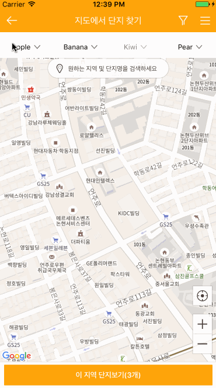

# YNDropDownMenu

[]
(http://cocoapods.org/pods/YNDropDownMenu)
[](https://github.com/Carthage/Carthage)
[](https://github.com/younatics/YNDropDownMenu/blob/master/LICENSE)
[![Platform]
(https://img.shields.io/cocoapods/p/YNDropDownMenu.svg?style=flat)](http://cocoapods.org/pods/YNDropDownMenu)
[](https://developer.apple.com/swift/)

#### [Listed 2nd at trending open source and 3rd at trending developer in Github Swift category [02/24/2017]](https://github.com/younatics/YNDropDownMenu/blob/master/Images/2nd.PNG)

## Updates

See [CHANGELOG](https://github.com/younatics/YNDropDownMenu/blob/master/CHANGELOG.md) for details

## Intoduction
The eligible dropdown menu, written in Swift 3, appears dropdown menu to display a view of related items when a user click on the dropdown menu. You can customize dropdown view whatever you like (e.g. UITableView, UICollectionView... etc)




## Requirements

`YNDropDownMenu` written in Swift 3. Compatible with iOS 8.0+

## Installation

### Cocoapods

YNDropDownMenu is available through [CocoaPods](http://cocoapods.org). To install
it, simply add the following line to your Podfile:

```ruby
pod 'YNDropDownMenu'
```
### Carthage
```
github "younatics/YNDropDownMenu"
```
## Usage
```swift
import YNDropDownMenu
```

Init view with frame`[CGRect]`, Views`[UIView]` and Titles`[String]`
```swift
let view = YNDropDownMenu(frame:frame, dropDownViews: dropDownViews, dropDownViewTitles: ["Apple", "Banana", "Kiwi", "Pear"])
self.addSubview(view)
```
done!

### Call hide menu in drop down views
Init view with frame`[CGRect]`, YNDropDownViews`[YNDropDownView]` and Titles`[String]` 
```swift
let view = YNDropDownMenu(frame:frame, YNDropDownViews: yNDropDownViews, dropDownViewTitles: ["Apple", "Banana", "Kiwi", "Pear"])
self.addSubview(view)
```

Custom YNDropDownView
```swift
class DropDownView: YNDropDownView
self.hideMenu()
```

### Customize

Show & Hide Menu 
```swift
view.showAndHideMenuAt(index:1)

// When view is already opened
view.hideMenu()
```

Disable & Enable Menu 
```swift
view.disabledMenuAt(index: 2)
view.enabledMenuAt(index: 3)
```

Button Image with 3 situations (normal, selected, disabled)
```swift
view.setImageWhen(normal: UIImage(named: "arrow_nor"), selected: UIImage(named: "arrow_sel"), disabled: UIImage(named: "arrow_dim"))
```

Label color with 3 situations
```swift
view.setLabelColorWhen(normal: UIColor.black, selected: UIColor.blue, disabled: UIColor.gray)
```

Label font with 3 situations
```swift
view.setLabelFontWhen(normal: UIFont.systemFont(ofSize: 12), selected: UIFont.boldSystemFont(ofSize: 12), disabled: UIFont.systemFont(ofSize: 12))
```

BlurEffectView
```swift
// Enadbled or Disabled first (Default true)
view.backgroundBlurEnabled = false

// Use this line if you want to change UIBlurEffectStyle
view.blurEffectStyle = .light

// Or customize blurEffectView(UIView)
let backgroundView = UIView()
backgroundView.backgroundColor = UIColor.black
view.blurEffectView = backgroundView

// Animation end alpha
view.blurEffectViewAlpha = 0.7
```

Animation duration
```swift
view.showMenuDuration = 0.5
view.hideMenuDuration = 0.3
```

Animation velocity, damping
```swift
view.showMenuSpringVelocity = 0.5
view.showMenuSpringWithDamping = 0.8

view.hideMenuSpringVelocity = 0.9
view.hideMenuSpringWithDamping = 0.8
```

## Author
[Younatics](http://younatics.github.io)


## License

YNDropDownMenu is available under the MIT license. See the LICENSE file for more info.
