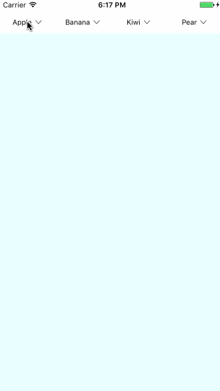

# YNDropDownMenu

[](http://cocoapods.org/pods/YNDropDownMenu)
[](http://cocoapods.org/pods/YNDropDownMenu)
[](http://cocoapods.org/pods/YNDropDownMenu)



## Requirements

`YNDropDownMenu` written in Swift 3. Compatible with iOS 8.0+

## Installation

YNDropDownMenu is available through [CocoaPods](http://cocoapods.org). To install
it, simply add the following line to your Podfile:

```ruby
pod "YNDropDownMenu"
```

## Usage

Import first 
```
import YNDropDownMenu
```

Init view with frame[CGRect], Views[UIView] and Titles[String]
```
let view = YNDropDownMenu(frame:frame, dropDownViews: dropDownViews, dropDownViewTitles: ["Apple", "Banana", "Kiwi", "Pear"])
self.addSubview(view)
```

Done!

To run the example project, clone the repo, and run `pod install` from the Example directory first.

### Customize

Show&Hide Menu

```
view.showAndHideMenuAt(index:1)
```

Animation duration

```
view.showMenuDuration = 0.5
view.hideMenuDuration = 0.3
```

Button Image with 4 situations (normal, highlighted, selected, disabled)
```
view.setImageWhen(normal: UIImage(named: "arrow_nor"), highlighted: UIImage(named: "arrow_sel"), selected: UIImage(named: "arrow_sel"), disabled: UIImage(named: "arrow_dim"))
```

Label color with 4 situations
```
view.setLabelColorWhen(normal: UIColor.black, highlighted: UIColor.yellow, selected: UIColor.blue, disabled: UIColor.gray)
```

## Author

younatics@gmail.com

## License

YNDropDownMenu is available under the MIT license. See the LICENSE file for more info.
